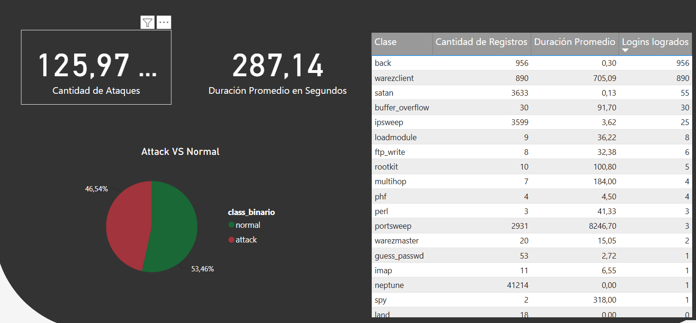
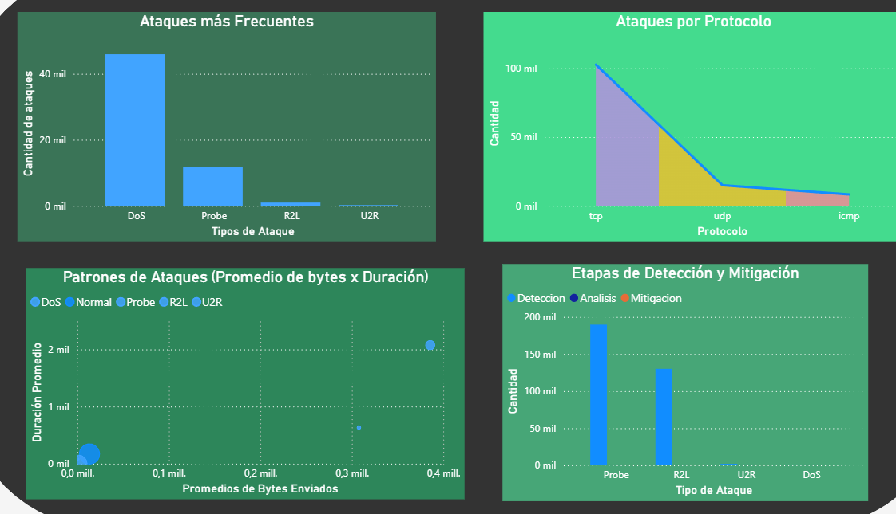
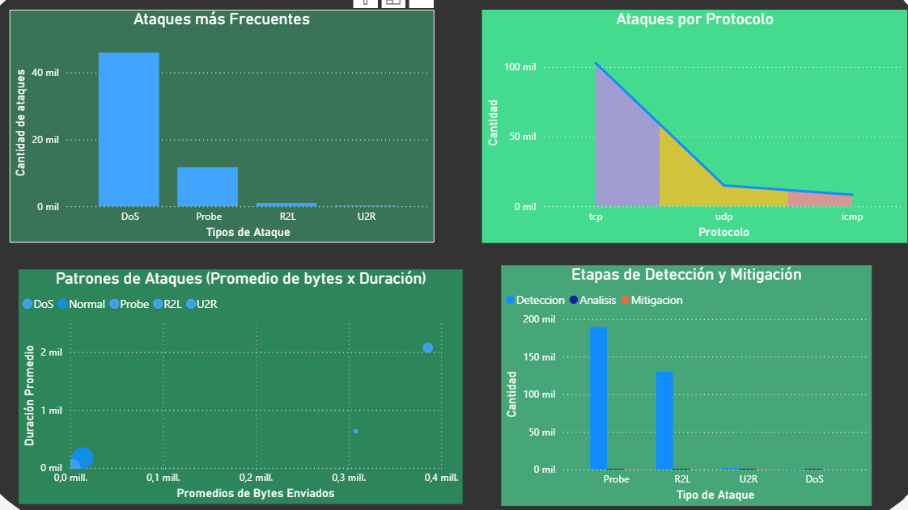
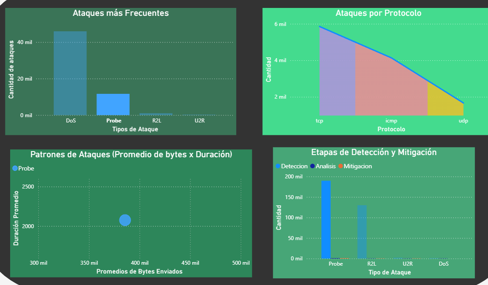
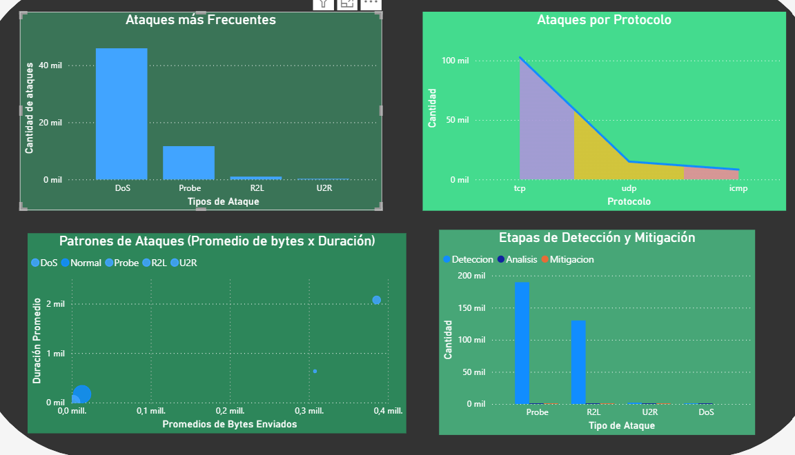
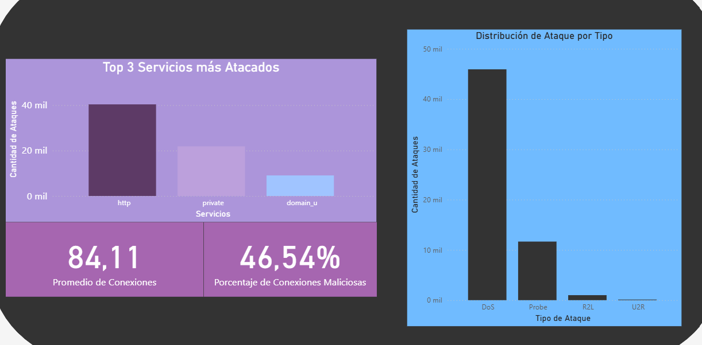

# Data-Analytics--CiberSecurity

## Descripción

Laboratorio práctico donde veremos diferentes ciberataques, se clasificarán dependiendo de su tipo, y veremos cuales son los mas comunes junto con otros datos como cuanto tiempo tomó la mitigación de dicho ataque.

# Objetivo
Mostrar datos difíciles de comprender para usuarios no técnicos en una forma que pueden entender fácilmente. 

---

# Justificación

Al realizar análisis de ciberataques muchas veces se deben presentar con la alta gerencia, o usuarios no técnicos.
Realizando gráficas de datos concretos y con una buena explicación normalmente basta para exponer de forma clara las situaciones. Como extra al tener datos de cuanto tiempo tomó a mitigación o la detección de los ataques podemos identificar que aspectos debe mejorar nuestro departamento ante futuras incidencias.

---

# Alcance

Los datos utilizados en este análisis no fueron creados artificialmente, por esta misma razón no se estará compartiendo el archivo de POWERBI y tampoco el dataset.
Esta sección cumplirá la función de mostrar este análisis de forma superficial.

---

# Página 1

Se puede apreciar una comparación entre tráfico de red normal y ataques, los ataques están clasificados por tipo, herramienta y protocolos.
También Observaremos métricas como el total de ataque, la duración promedio y una vista de datos sanitizados aptos para ser compartidos

---

# Página 2
Esta página se centra más en analizar la intrusión, veremos el tipo de ataque mas frecuente, cuanto tiempo toma la mitigación y la detección.

Gráficas basadas en los ataques DoS.

Gráficas basadas en ataques Probe.

Gráficas basadas en ataques R2L.

---

# Dashboard

En esta página veremos un top de los servicios mas atacados junto con un porcentaje de las conexiones que resultaron ser maliciosas

---

## Información Principal
Al analizar los datos de este dataset logramos identificar la siguiente información
|Resultado |
|---|
| Top 3 de servicios más atacados | 
| Ataques por protocolo | 
| Ataques más frecuentes  | 
| Cantidad total de ataques recibidos |

